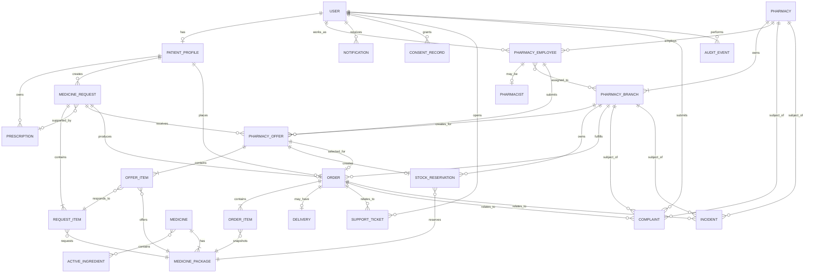

# Dawak Release 1 Domain Model and Lifecycle Specification

**Project:** Dawak — دواك
**Epic:** DAW-1
**Story:** DAW-2 — Design core domain model, business rules, and lifecycle state machines
**Document version:** 1.0
**Schema version:** `dawak-domain-v1`
**Status:** Reviewed implementation baseline
**Reviewed:** 2026-08-01
**Architecture:** Spring Boot modular monolith
**Database:** PostgreSQL
**Purpose:** Define the stable Release 1 domain model and lifecycle rules before API or interface implementation.

---

# 1. Scope

This specification defines the Release 1 entities, aggregates, relationships, identifiers, ownership rules, lifecycle states, transition rules, audit requirements, retention-sensitive fields, concurrency controls, and idempotency boundaries for Dawak.

Dawak is a **request-and-fulfillment platform**.

It is not:

* A classified-ad marketplace
* A patient-to-patient sales platform
* A patient-to-patient donation platform
* A general inventory marketplace
* A replacement for pharmacy or pharmacist decision-making

The central Release 1 workflow is:

```text
Patient creates medicine request
        ↓
Prescription reviewed when required
        ↓
Request distributed to eligible pharmacy branches
        ↓
Pharmacy branch submits quantity-limited offer
        ↓
Patient selects one offer
        ↓
Stock reservation is created
        ↓
Order is created
        ↓
Pharmacy prepares medicine
        ↓
Pickup or delivery is completed
```

---

# 2. Domain Design Principles

## 2.1 Separate aggregates

The following concepts must remain separate entities or aggregates:

* Medicine
* Medicine Package
* Prescription
* Medicine Request
* Pharmacy Offer
* Stock Reservation
* Order
* Pharmacy Branch
* Delivery

They must not be collapsed into one advertisement, listing, transaction, or inventory entity.

## 2.2 Branch-specific supply

Every offer belongs to exactly one verified pharmacy branch.

A pharmacy organization may contain multiple branches, but availability, pricing, preparation time, delivery capability, offers, reservations, and fulfillment are branch-specific.

## 2.3 Exact medicine configuration

Requests and offers must reference an exact `MedicinePackage`, not only a free-text medicine name.

An exact package identifies:

* Medicine
* Active ingredients
* Strength
* Strength unit
* Dosage form
* Package size
* Package unit
* Manufacturer
* Barcode, where available

## 2.4 No patient-originated supply

A patient can create a medicine request but cannot create:

* A pharmacy offer
* A stock reservation
* A medicine listing
* A sale listing
* A donation listing
* An inventory record
* A patient-to-patient order

Every offer must be created by an authorized pharmacy employee for an approved pharmacy branch.

## 2.5 Manual availability without inventory coupling

Release 1 supports manual pharmacy availability.

An offer records the quantity a pharmacy branch confirms as available at offer time.

The Release 1 model does not require:

* Pharmacy POS integration
* Real-time stock synchronization
* Warehouse inventory
* Inventory ledger
* Manufacturer inventory integration

Future inventory systems may provide availability information, but the core Offer and Reservation models remain valid.

---

# 3. Global Entity Conventions

## 3.1 Identifiers

All entities use UUID identifiers.

```java
UUID id;
```

Recommended database type:

```sql
uuid
```

Publicly displayed entities may also have human-readable references.

Examples:

```text
Medicine Request: REQ-2026-00000124
Offer: OFF-2026-00000985
Order: ORD-2026-00000381
Support Ticket: TKT-2026-00000214
Complaint: CMP-2026-00000076
Incident: INC-2026-00000032
```

Human-readable references are not primary keys.

## 3.2 Timestamps

All persisted timestamps use UTC.

Recommended Java type:

```java
Instant
```

Most mutable entities contain:

```text
created_at
created_by
updated_at
updated_by
version
```

## 3.3 Optimistic locking

The following entities must contain a version field:

```java
@Version
private long version;
```

Required for:

* Pharmacy
* Pharmacy Branch
* Pharmacy Employee
* Prescription
* Medicine Request
* Pharmacy Offer
* Stock Reservation
* Order
* Delivery
* Support Ticket
* Complaint
* Incident

## 3.4 Money

Monetary values must use decimal values and an explicit currency.

```text
amount numeric(19,4)
currency char(3)
```

Release 1 default currency:

```text
EGP
```

Floating-point types must not be used for prices.

## 3.5 Quantity

Medicine quantities use positive integers unless a future product type requires decimal quantities.

```text
quantity integer
```

Release 1 rule:

```text
quantity > 0
```

## 3.6 Status history

Lifecycle state changes must be retained in separate immutable history records where operational traceability is required.

At minimum:

* Prescription status history
* Medicine-request status history
* Offer status history
* Reservation status history
* Order status history
* Delivery status history

## 3.7 Reason fields

The following actions require structured reasons:

* Rejection
* Cancellation
* Fulfillment failure
* Prescription rejection
* Offer withdrawal after publication
* Administrative override
* Pharmacy suspension
* Branch suspension
* Order-status correction
* Delivery failure
* Restricted-product block

A reason consists of:

```text
reason_code
reason_text_optional
recorded_by
recorded_at
```

---

# 4. Aggregate Ownership

| Aggregate             | Aggregate root    | Owner                                   |
| --------------------- | ----------------- | --------------------------------------- |
| Identity              | User              | Platform                                |
| Patient               | Patient Profile   | User                                    |
| Pharmacy organization | Pharmacy          | Platform-approved pharmacy organization |
| Pharmacy branch       | Pharmacy Branch   | Pharmacy                                |
| Pharmacy workforce    | Pharmacy Employee | Pharmacy                                |
| Catalogue             | Medicine          | Platform                                |
| Prescription          | Prescription      | Patient                                 |
| Medicine request      | Medicine Request  | Patient                                 |
| Pharmacy offer        | Pharmacy Offer    | Pharmacy Branch                         |
| Reservation           | Stock Reservation | Pharmacy Branch and selected Offer      |
| Order                 | Order             | Patient and fulfilling Pharmacy Branch  |
| Delivery              | Delivery          | Order                                   |
| Notification          | Notification      | Recipient User                          |
| Support               | Support Ticket    | Requesting User or Platform             |
| Complaint             | Complaint         | Complainant User                        |
| Incident              | Incident          | Platform compliance/operations          |
| Consent               | Consent Record    | User                                    |
| Audit                 | Audit Event       | Platform                                |

---

# 5. Entity Definitions

# 5.1 User

Represents an authenticated platform identity.

## Key attributes

```text
id
phone_number
phone_number_verified_at
email_optional
email_verified_at_optional
password_hash_optional
status
preferred_language
last_login_at
created_at
updated_at
version
```

## Status enum

```java
public enum UserStatusV1 {
    PENDING_VERIFICATION,
    ACTIVE,
    LOCKED,
    SUSPENDED,
    DEACTIVATED,
    DELETION_PENDING,
    DELETED
}
```

## Relationships

* User may have one Patient Profile.
* User may have multiple Pharmacy Employee records.
* User may create Medicine Requests.
* User may create or review Pharmacy Offers through Pharmacy Employee membership.
* User may receive Notifications.
* User may create Support Tickets and Complaints.
* User may have multiple Consent Records.
* User actions may produce Audit Events.

## Retention-sensitive attributes

* Phone number
* Email address
* Login history
* Session identifiers
* Deletion-request timestamp
* Suspension reason

Authentication secrets must not be stored in audit events.

---

# 5.2 Patient Profile

Represents patient-specific profile information.

## Key attributes

```text
id
user_id
first_name
last_name
birth_year_optional
default_city_id_optional
default_area_id_optional
preferred_fulfillment_type_optional
created_at
updated_at
version
```

## Ownership

Owned by exactly one User.

## Relationships

* One User has zero or one Patient Profile.
* Patient Profile owns Medicine Requests.
* Patient Profile owns Prescriptions.
* Patient Profile may own Orders.
* Patient Profile may create Complaints.

## Rules

* Patient Profile cannot own a Pharmacy Offer.
* Patient Profile cannot own stock.
* Patient Profile cannot act as a medicine supplier.
* Medical or identity information must be minimized.

---

# 5.3 Pharmacy

Represents the legal or operational pharmacy organization.

## Key attributes

```text
id
legal_name
public_name
license_number
license_expiry_date
tax_identifier_optional
commercial_registration_optional
status
verification_status
verified_at_optional
verified_by_optional
suspension_reason_code_optional
created_at
updated_at
version
```

## Status enums

```java
public enum PharmacyStatusV1 {
    DRAFT,
    PENDING_REVIEW,
    APPROVED,
    REJECTED,
    SUSPENDED,
    DOCUMENTS_EXPIRED,
    CLOSED
}
```

## Relationships

* Pharmacy owns one or more Pharmacy Branches.
* Pharmacy owns Pharmacy Employees.
* Pharmacy has verification and legal documents.
* Pharmacy may be involved in Complaints and Incidents.

## Rules

* A Pharmacy cannot fulfill requests unless its status is `APPROVED`.
* A suspended or document-expired Pharmacy cannot create new offers.
* Existing active offers must be withdrawn or expired when the Pharmacy is suspended.

---

# 5.4 Pharmacy Branch

Represents a physical pharmacy location.

## Key attributes

```text
id
pharmacy_id
branch_code
name
status
city_id
area_id
address_line
latitude_optional
longitude_optional
phone_number
pickup_enabled
delivery_enabled
prescription_handling_enabled
accepting_requests
manual_availability_enabled
created_at
updated_at
version
```

## Status enum

```java
public enum PharmacyBranchStatusV1 {
    PENDING_APPROVAL,
    ACTIVE,
    TEMPORARILY_INACTIVE,
    SUSPENDED,
    CLOSED
}
```

## Relationships

* Belongs to one Pharmacy.
* Has many Pharmacy Employees.
* Creates Pharmacy Offers.
* Owns Stock Reservations.
* Fulfills Orders.
* May fulfill Deliveries.
* May be subject to Complaints and Incidents.

## Rules

A branch can create an offer only when:

```text
pharmacy.status = APPROVED
and branch.status = ACTIVE
and branch.accepting_requests = true
```

Prescription-required offers additionally require:

```text
branch.prescription_handling_enabled = true
```

---

# 5.5 Pharmacy Employee

Represents a user’s employment or operational membership in a pharmacy.

## Key attributes

```text
id
user_id
pharmacy_id
employee_number_optional
status
job_role
created_at
updated_at
version
```

## Status enum

```java
public enum PharmacyEmployeeStatusV1 {
    INVITED,
    ACTIVE,
    SUSPENDED,
    REVOKED
}
```

## Relationships

* Belongs to one User.
* Belongs to one Pharmacy.
* May be assigned to one or more Pharmacy Branches.
* May create Pharmacy Offers.
* May update Orders.
* May perform prescription-related actions only when linked to a Pharmacist record or authorized role.

## Branch assignment entity

```text
pharmacy_employee_branch
- pharmacy_employee_id
- pharmacy_branch_id
- permissions
- assigned_at
- revoked_at_optional
```

## Rules

* An employee must have active branch membership to act for that branch.
* Offer creator identity must always be retained.
* Revoked employees cannot perform new business operations.
* Historical actions remain traceable after access revocation.

---

# 5.6 Pharmacist

Represents professional pharmacist authorization attached to a Pharmacy Employee.

## Key attributes

```text
id
pharmacy_employee_id
professional_license_number
license_expiry_date
verification_status
verified_at_optional
verified_by_optional
status
created_at
updated_at
version
```

## Status enum

```java
public enum PharmacistStatusV1 {
    PENDING_VERIFICATION,
    VERIFIED,
    REJECTED,
    SUSPENDED,
    LICENSE_EXPIRED
}
```

## Relationships

* Belongs to exactly one Pharmacy Employee.
* May review Prescriptions.
* May authorize prescription-required offers where policy requires.
* May record professional decisions in Audit Events.

## Rules

A user may perform pharmacist-restricted actions only if:

```text
pharmacy_employee.status = ACTIVE
and pharmacist.status = VERIFIED
and pharmacist.license_expiry_date >= current_date
```

---

# 5.7 Active Ingredient

Represents a normalized pharmaceutical ingredient.

## Key attributes

```text
id
standard_name
arabic_name
english_name
reference_code_optional
active
created_at
updated_at
```

## Relationships

* May be linked to many Medicines.
* A Medicine may contain one or more Active Ingredients.

## Join entity

```text
medicine_active_ingredient
- medicine_id
- active_ingredient_id
- amount_optional
- amount_unit_optional
- sequence_number
```

---

# 5.8 Medicine

Represents a conceptual medicinal product or branded product family.

## Key attributes

```text
id
arabic_name
english_name
manufacturer_id
description_optional
prescription_required
restricted
restriction_code_optional
storage_type
active
created_at
updated_at
version
```

## Status-related fields

```text
prescription_required
restricted
active
```

## Relationships

* Has one or more Active Ingredients.
* Has one or more Medicine Packages.
* May be referenced by catalogue aliases.
* Restriction changes produce Audit Events.

## Rules

* `restricted = true` blocks request or offer workflows unless an explicitly supported workflow exists.
* Release 1 does not support restricted products unless individually enabled by approved business policy.
* `prescription_required = true` requires an approved Prescription before matching or offer selection.

---

# 5.9 Medicine Package

Represents the exact orderable medicine configuration.

## Key attributes

```text
id
medicine_id
strength_value
strength_unit
dosage_form_code
package_size_value
package_size_unit
route_of_administration_optional
barcode_optional
official_price_optional
currency_optional
active
created_at
updated_at
version
```

## Relationships

* Belongs to one Medicine.
* Referenced by Request Items.
* Referenced by Offer Items.
* Referenced by Order Items.
* Referenced by Stock Reservations.

## Exact configuration rule

A Request Item and matching Offer Item must reference the same `medicine_package_id`.

Release 1 does not allow automatic substitution.

Any future substitute workflow must create an explicit alternative proposal requiring pharmacist and patient approval.

---

# 5.10 Prescription

Represents a patient-provided prescription document and its review lifecycle.

## Key attributes

```text
id
patient_profile_id
storage_key
original_filename
content_type
file_size
checksum
status
uploaded_at
reviewed_at_optional
reviewed_by_pharmacist_id_optional
review_reason_code_optional
review_comment_optional
valid_from_optional
valid_until_optional
retention_until
deleted_at_optional
created_at
updated_at
version
```

## Status enum

```java
public enum PrescriptionStatusV1 {
    UPLOADED,
    PENDING_REVIEW,
    NEEDS_CLARIFICATION,
    APPROVED,
    REJECTED,
    EXPIRED,
    RETENTION_EXPIRED,
    DELETED
}
```

## Relationships

* Belongs to one Patient Profile.
* May be associated with one or more Medicine Requests where policy permits.
* Reviewed by a verified Pharmacist.
* Access creates Prescription Access Audit Events.

## Retention-sensitive attributes

* Storage key
* File checksum
* Review comments
* Reviewer identity
* Retention deadline
* Deletion timestamp

## Rules

* Prescription binary content is stored in private object storage.
* Prescription cannot be publicly addressed.
* Prescription access is permission-checked and audited.
* Approved Prescription must still be within its validity period.
* Rejected or expired Prescription cannot satisfy a prescription gate.
* Prescription approval must identify the reviewer.

---

# 5.11 Medicine Request

Represents a patient’s request to locate and obtain medicine.

## Key attributes

```text
id
reference_number
patient_profile_id
prescription_id_optional
city_id
area_id
fulfillment_preference
urgency
status
submitted_at_optional
matching_started_at_optional
expires_at_optional
selected_offer_id_optional
cancel_reason_code_optional
cancel_reason_text_optional
cancelled_by_optional
cancelled_at_optional
created_at
updated_at
version
```

## Status enum

```java
public enum MedicineRequestStatusV1 {
    DRAFT,
    AWAITING_PRESCRIPTION,
    PENDING_PRESCRIPTION_REVIEW,
    READY_FOR_MATCHING,
    MATCHING,
    OFFERS_AVAILABLE,
    OFFER_SELECTED,
    UNFULFILLED,
    EXPIRED,
    CANCELLED,
    COMPLETED
}
```

## Relationships

* Belongs to one Patient Profile.
* Contains one or more Request Items.
* May reference one Prescription.
* Receives zero or more Pharmacy Offers.
* May select exactly one Pharmacy Offer.
* Produces at most one active Order in Release 1.
* May be associated with Support Tickets, Complaints, Incidents, and Audit Events.

## Release 1 simplification

Release 1 may enforce:

```text
one Medicine Request contains exactly one Request Item
```

The schema supports multiple Request Items for future use.

## Rules

* Request owner must be a Patient Profile.
* Request cannot identify a patient as supplier.
* Restricted Medicine Package cannot be requested.
* Prescription-required items require approved Prescription before matching.
* Request quantity must be positive and within configured limits.
* Request must expire if no offer is selected within its validity period.

---

# 5.12 Request Item

Represents an exact medicine package and quantity requested.

## Key attributes

```text
id
medicine_request_id
medicine_package_id
requested_quantity
notes_optional
created_at
updated_at
```

## Relationships

* Belongs to one Medicine Request.
* References one Medicine Package.

## Rules

```text
requested_quantity > 0
```

The package must be:

```text
medicine_package.active = true
medicine.active = true
medicine.restricted = false
```

---

# 5.13 Pharmacy Offer

Represents a pharmacy branch’s time-limited availability response.

## Key attributes

```text
id
reference_number
medicine_request_id
pharmacy_branch_id
created_by_pharmacy_employee_id
status
currency
subtotal_amount
delivery_fee_amount
total_amount
preparation_minutes
expires_at
submitted_at
withdraw_reason_code_optional
withdraw_reason_text_optional
created_at
updated_at
version
```

## Status enum

```java
public enum PharmacyOfferStatusV1 {
    DRAFT,
    SUBMITTED,
    ACTIVE,
    SELECTED,
    NOT_SELECTED,
    EXPIRED,
    WITHDRAWN,
    INVALIDATED
}
```

## Relationships

* Belongs to one Medicine Request.
* Belongs to exactly one Pharmacy Branch.
* Created by exactly one Pharmacy Employee.
* Contains one or more Offer Items.
* May create one Stock Reservation when selected.
* May create one Order when selected.
* Generates Audit Events.

## Rules

Every submitted offer must be:

* Branch-specific
* Time-limited
* Quantity-limited
* Traceable to its creator
* Linked to an open Medicine Request
* Based on exact Medicine Package matching
* Created by an authorized employee
* Created for an approved and active branch

Release 1 manual availability is represented by the offer itself.

No warehouse or inventory record is required.

---

# 5.14 Offer Item

Represents a package and quantity offered by a pharmacy branch.

## Key attributes

```text
id
pharmacy_offer_id
request_item_id
medicine_package_id
available_quantity
unit_price
currency
created_at
updated_at
```

## Rules

```text
available_quantity > 0
unit_price >= 0
```

The Offer Item must match the Request Item:

```text
offer_item.medicine_package_id =
request_item.medicine_package_id
```

The pharmacy cannot offer more quantity than it manually confirms as available.

The offered quantity may be lower than requested only if partial offers are enabled by policy.

Release 1 recommended rule:

```text
available_quantity >= requested_quantity
```

---

# 5.15 Stock Reservation

Represents temporary allocation of the offered quantity after offer selection.

## Key attributes

```text
id
pharmacy_branch_id
pharmacy_offer_id
order_id_optional
medicine_package_id
reserved_quantity
status
reserved_at
expires_at
released_at_optional
release_reason_code_optional
consumed_at_optional
created_at
updated_at
version
```

## Status enum

```java
public enum StockReservationStatusV1 {
    ACTIVE,
    CONSUMED,
    RELEASED,
    EXPIRED,
    CANCELLED
}
```

## Relationships

* Belongs to one Pharmacy Branch.
* Belongs to one selected Pharmacy Offer.
* References one Medicine Package.
* Belongs to one Order after order creation.
* Created in the same transaction as offer selection and order creation.

## Rules

* A reservation may only be created from a selected active offer.
* Reservation quantity equals selected Offer Item quantity.
* One selected Offer Item creates one active Reservation.
* Reservation release must be idempotent.
* Reservation cannot return from terminal state to `ACTIVE`.
* Reservation must be released on qualifying cancellation or confirmation timeout.
* Reservation becomes `CONSUMED` after successful fulfillment.

---

# 5.16 Order

Represents a patient’s selected pharmacy fulfillment transaction.

## Key attributes

```text
id
reference_number
medicine_request_id
selected_offer_id
patient_profile_id
pharmacy_branch_id
status
fulfillment_type
currency
subtotal_amount
delivery_fee_amount
total_amount
confirmation_deadline
confirmed_at_optional
preparation_started_at_optional
ready_at_optional
fulfilled_at_optional
cancel_reason_code_optional
cancel_reason_text_optional
cancelled_by_optional
cancelled_at_optional
failure_reason_code_optional
failure_reason_text_optional
created_at
updated_at
version
```

## Status enum

```java
public enum OrderStatusV1 {
    PENDING_PHARMACY_CONFIRMATION,
    CONFIRMED,
    PREPARING,
    READY_FOR_PICKUP,
    OUT_FOR_DELIVERY,
    FULFILLED,
    CANCELLED,
    FULFILLMENT_FAILED
}
```

## Relationships

* Belongs to one Medicine Request.
* Belongs to one selected Pharmacy Offer.
* Belongs to one Patient Profile.
* Fulfilled by one Pharmacy Branch.
* Contains one or more Order Items.
* Owns zero or one Delivery.
* Uses one or more Stock Reservations.
* May have Support Tickets, Complaints, Incidents, and Audit Events.

## Rules

* Order can only be created from a selected offer.
* Order branch must equal Offer branch.
* Order patient must equal Request patient.
* Order values are copied from the selected Offer and become immutable commercial snapshots.
* Order Item package and quantity must correspond to selected Offer Items.
* An Order cannot change its Pharmacy Branch after creation.
* An Order cannot be transferred to another patient.

---

# 5.17 Order Item

Represents the immutable medicine and quantity snapshot in an Order.

## Key attributes

```text
id
order_id
medicine_package_id
medicine_name_snapshot
strength_snapshot
dosage_form_snapshot
package_size_snapshot
quantity
unit_price
line_total
currency
created_at
```

## Rules

* Snapshot values preserve what was ordered even if catalogue data later changes.
* Quantity must equal the selected and reserved quantity.
* Order Items are not editable after Order creation.

---

# 5.18 Delivery

Represents delivery fulfillment for a delivery-type Order.

## Key attributes

```text
id
order_id
status
delivery_provider_type
external_delivery_reference_optional
recipient_name
recipient_phone_masked
delivery_address_snapshot
assigned_at_optional
picked_up_at_optional
out_for_delivery_at_optional
delivered_at_optional
failed_at_optional
failure_reason_code_optional
failure_reason_text_optional
proof_of_delivery_reference_optional
created_at
updated_at
version
```

## Status enum

```java
public enum DeliveryStatusV1 {
    NOT_REQUIRED,
    PENDING_ASSIGNMENT,
    ASSIGNED,
    PICKED_UP,
    OUT_FOR_DELIVERY,
    DELIVERED,
    DELIVERY_FAILED,
    CANCELLED
}
```

## Relationships

* Belongs to exactly one Order.
* Exists only for `fulfillment_type = DELIVERY`.
* May be fulfilled internally by the pharmacy or through an external provider.
* May generate Complaints and Incidents.

## Rules

* Delivery cannot be created for pickup orders.
* Delivery `DELIVERED` causes Order to become `FULFILLED`.
* Delivery failure does not automatically cancel the Order.
* Retry or cancellation policy determines the next action after failure.
* Delivery provider receives only minimum required patient information.

---

# 5.19 Notification

Represents a durable in-app notification.

## Key attributes

```text
id
recipient_user_id
type
title_key
message_key
payload_json
related_entity_type_optional
related_entity_id_optional
status
created_at
read_at_optional
expires_at_optional
```

## Status enum

```java
public enum NotificationStatusV1 {
    CREATED,
    DISPATCHED,
    DELIVERED,
    FAILED,
    READ,
    EXPIRED
}
```

## Relationships

* Belongs to one recipient User.
* May reference a Request, Offer, Order, Delivery, Support Ticket, or Complaint.
* May have channel-delivery records.

## Rules

Sensitive medicine or prescription data must not be placed in public push-notification content.

---

# 5.20 Support Ticket

Represents a general support conversation.

## Key attributes

```text
id
reference_number
opened_by_user_id
assigned_to_user_id_optional
category
priority
status
related_entity_type_optional
related_entity_id_optional
subject
description
resolved_at_optional
closed_at_optional
created_at
updated_at
version
```

## Status enum

```java
public enum SupportTicketStatusV1 {
    OPEN,
    IN_PROGRESS,
    WAITING_FOR_REQUESTER,
    WAITING_FOR_PHARMACY,
    ESCALATED,
    RESOLVED,
    CLOSED
}
```

## Relationships

* Opened by one User.
* May relate to Request, Offer, Order, Delivery, Pharmacy, or account.
* May create a Complaint or Incident when escalated.

---

# 5.21 Complaint

Represents a formal complaint requiring investigation and resolution.

## Key attributes

```text
id
reference_number
complainant_user_id
against_pharmacy_id_optional
against_branch_id_optional
category
severity
status
related_order_id_optional
related_delivery_id_optional
related_request_id_optional
description
resolution_code_optional
resolution_text_optional
resolved_by_optional
resolved_at_optional
created_at
updated_at
version
```

## Status enum

```java
public enum ComplaintStatusV1 {
    SUBMITTED,
    ACKNOWLEDGED,
    UNDER_REVIEW,
    WAITING_FOR_INFORMATION,
    ESCALATED,
    RESOLVED,
    REJECTED,
    CLOSED
}
```

## Rules

* Complaint is separate from Support Ticket.
* A Support Ticket may produce a Complaint.
* Complaint closure requires a resolution or rejection reason.
* Serious complaints may produce an Incident.

---

# 5.22 Incident

Represents a safety, compliance, privacy, or operational incident.

## Key attributes

```text
id
reference_number
type
severity
status
reported_by_user_id_optional
assigned_to_user_id_optional
related_user_id_optional
related_pharmacy_id_optional
related_branch_id_optional
related_request_id_optional
related_order_id_optional
related_delivery_id_optional
summary
details
external_reference_optional
resolution_code_optional
resolved_at_optional
created_at
updated_at
version
```

## Status enum

```java
public enum IncidentStatusV1 {
    REPORTED,
    TRIAGED,
    INVESTIGATING,
    CONTAINED,
    REMEDIATION_IN_PROGRESS,
    RESOLVED,
    CLOSED
}
```

## Incident types

```java
public enum IncidentTypeV1 {
    WRONG_MEDICINE,
    WRONG_STRENGTH,
    DAMAGED_PRODUCT,
    SUSPECTED_COUNTERFEIT,
    RESTRICTED_PRODUCT_ATTEMPT,
    PRESCRIPTION_MISUSE,
    PRIVACY_BREACH,
    STORAGE_CONCERN,
    DELIVERY_TEMPERATURE_CONCERN,
    UNAUTHORIZED_ACCESS,
    SYSTEM_SECURITY_EVENT,
    OTHER
}
```

---

# 5.23 Consent Record

Represents versioned user consent.

## Key attributes

```text
id
user_id
consent_type
document_version
status
granted_at
withdrawn_at_optional
source
ip_address_optional
user_agent_optional
created_at
```

## Status enum

```java
public enum ConsentStatusV1 {
    GRANTED,
    WITHDRAWN,
    EXPIRED,
    SUPERSEDED
}
```

## Consent types

```java
public enum ConsentTypeV1 {
    TERMS_OF_SERVICE,
    PRIVACY_POLICY,
    PRESCRIPTION_PROCESSING,
    NOTIFICATION_MARKETING,
    DATA_SHARING_WITH_PHARMACY,
    DELIVERY_DATA_SHARING
}
```

## Rules

* Consent records are append-only.
* A changed document version requires a new Consent Record.
* Withdrawal does not delete historical evidence of prior consent.
* Operationally required processing may need separate legal review.

---

# 5.24 Audit Event

Represents an immutable record of a sensitive or important action.

## Key attributes

```text
id
event_type
actor_user_id_optional
actor_role_optional
actor_pharmacy_employee_id_optional
entity_type
entity_id
action
reason_code_optional
reason_text_optional
old_state_optional
new_state_optional
metadata_json_optional
correlation_id
idempotency_key_optional
ip_address_optional
user_agent_optional
occurred_at
```

## Rules

* Audit Events are immutable.
* Audit Events cannot be updated or deleted through business APIs.
* Sensitive documents and secrets must not be copied into audit metadata.
* Audit Event creation must occur within the same transaction as the audited business state change where possible.

---

# 6. ERD



---

# 7. Lifecycle Specifications

# 7.1 Medicine Request Lifecycle

## Allowed transitions

```text
DRAFT
  → AWAITING_PRESCRIPTION
  → READY_FOR_MATCHING
  → CANCELLED

AWAITING_PRESCRIPTION
  → PENDING_PRESCRIPTION_REVIEW
  → CANCELLED
  → EXPIRED

PENDING_PRESCRIPTION_REVIEW
  → READY_FOR_MATCHING
  → AWAITING_PRESCRIPTION
  → CANCELLED
  → EXPIRED

READY_FOR_MATCHING
  → MATCHING
  → CANCELLED
  → EXPIRED

MATCHING
  → OFFERS_AVAILABLE
  → UNFULFILLED
  → CANCELLED
  → EXPIRED

OFFERS_AVAILABLE
  → OFFER_SELECTED
  → UNFULFILLED
  → CANCELLED
  → EXPIRED

OFFER_SELECTED
  → COMPLETED
  → CANCELLED

UNFULFILLED
  → MATCHING
  → CANCELLED
  → EXPIRED

EXPIRED
  → terminal

CANCELLED
  → terminal

COMPLETED
  → terminal
```

## Disallowed examples

* `DRAFT → OFFER_SELECTED`
* `AWAITING_PRESCRIPTION → MATCHING`
* `EXPIRED → OFFERS_AVAILABLE`
* `CANCELLED → MATCHING`
* `COMPLETED → CANCELLED`

## Gates

`READY_FOR_MATCHING` requires:

```text
all Request Items reference active packages
all Medicines are active
no Medicine is restricted
all quantities are valid
required Prescription is APPROVED and valid
```

`OFFER_SELECTED` requires:

```text
selected Offer is ACTIVE
Offer is not expired
Offer belongs to the Request
Offer quantity satisfies Request
Offer branch is active
Offer selection is atomic
```

---

# 7.2 Prescription Lifecycle

## Allowed transitions

```text
UPLOADED
  → PENDING_REVIEW
  → DELETED

PENDING_REVIEW
  → APPROVED
  → REJECTED
  → NEEDS_CLARIFICATION
  → EXPIRED

NEEDS_CLARIFICATION
  → PENDING_REVIEW
  → REJECTED
  → EXPIRED
  → DELETED

APPROVED
  → EXPIRED
  → RETENTION_EXPIRED

REJECTED
  → RETENTION_EXPIRED
  → DELETED

EXPIRED
  → RETENTION_EXPIRED

RETENTION_EXPIRED
  → DELETED

DELETED
  → terminal
```

## Disallowed examples

* `REJECTED → APPROVED` without resubmission/re-review
* `DELETED → PENDING_REVIEW`
* `EXPIRED → APPROVED`
* `UPLOADED → APPROVED` without review

## Review requirements

Approval, rejection, and clarification require:

* Verified Pharmacist or authorized compliance role
* Reason or review note where applicable
* Review timestamp
* Audit Event
* Optimistic concurrency check

---

# 7.3 Pharmacy Offer Lifecycle

## Allowed transitions

```text
DRAFT
  → SUBMITTED
  → WITHDRAWN

SUBMITTED
  → ACTIVE
  → INVALIDATED
  → WITHDRAWN

ACTIVE
  → SELECTED
  → NOT_SELECTED
  → EXPIRED
  → WITHDRAWN
  → INVALIDATED

SELECTED
  → terminal for commercial selection

NOT_SELECTED
  → terminal

EXPIRED
  → terminal

WITHDRAWN
  → terminal

INVALIDATED
  → terminal
```

## Disallowed examples

* `EXPIRED → ACTIVE`
* `NOT_SELECTED → SELECTED`
* `WITHDRAWN → ACTIVE`
* `SELECTED → WITHDRAWN`
* Changing Pharmacy Branch after submission

## Offer gates

Submission requires:

* Approved Pharmacy
* Active Pharmacy Branch
* Active Pharmacy Employee
* Branch permission to submit offer
* Exact package match
* Valid quantity
* Non-negative pricing
* Future expiration timestamp
* Open Request
* Approved Prescription where required

---

# 7.4 Stock Reservation Lifecycle

## Allowed transitions

```text
ACTIVE
  → CONSUMED
  → RELEASED
  → EXPIRED
  → CANCELLED

CONSUMED
  → terminal

RELEASED
  → terminal

EXPIRED
  → terminal

CANCELLED
  → terminal
```

## Release triggers

Reservation must become `RELEASED` or `CANCELLED` when:

* Pharmacy rejects Order before preparation
* Patient cancels within allowed cancellation window
* Order confirmation deadline expires
* Order is administratively cancelled
* Offer selection is rolled back
* Pharmacy Branch is suspended before confirmation
* Fulfillment fails and no retry is possible

Reservation becomes `EXPIRED` when its `expires_at` passes before confirmation.

Reservation becomes `CONSUMED` when fulfillment completes.

## Idempotency rule

Repeated release operations must produce the same terminal result without duplicating quantity changes or audit effects.

---

# 7.5 Order Lifecycle

## Allowed transitions

```text
PENDING_PHARMACY_CONFIRMATION
  → CONFIRMED
  → CANCELLED
  → FULFILLMENT_FAILED

CONFIRMED
  → PREPARING
  → CANCELLED
  → FULFILLMENT_FAILED

PREPARING
  → READY_FOR_PICKUP
  → OUT_FOR_DELIVERY
  → CANCELLED
  → FULFILLMENT_FAILED

READY_FOR_PICKUP
  → FULFILLED
  → CANCELLED
  → FULFILLMENT_FAILED

OUT_FOR_DELIVERY
  → FULFILLED
  → FULFILLMENT_FAILED

FULFILLMENT_FAILED
  → PREPARING
  → OUT_FOR_DELIVERY
  → CANCELLED

FULFILLED
  → terminal

CANCELLED
  → terminal
```

## Conditional transitions

```text
PREPARING → READY_FOR_PICKUP
only when fulfillment_type = PICKUP

PREPARING → OUT_FOR_DELIVERY
only when fulfillment_type = DELIVERY

READY_FOR_PICKUP → FULFILLED
requires collection confirmation

OUT_FOR_DELIVERY → FULFILLED
requires Delivery status = DELIVERED
```

## Disallowed examples

* `PENDING_PHARMACY_CONFIRMATION → FULFILLED`
* `CONFIRMED → OUT_FOR_DELIVERY` without preparation
* `READY_FOR_PICKUP → OUT_FOR_DELIVERY`
* `FULFILLED → CANCELLED`
* `CANCELLED → PREPARING`
* Changing ordered Medicine Package after creation

---

# 7.6 Delivery Lifecycle

## Allowed transitions

```text
NOT_REQUIRED
  → terminal

PENDING_ASSIGNMENT
  → ASSIGNED
  → CANCELLED

ASSIGNED
  → PICKED_UP
  → CANCELLED
  → DELIVERY_FAILED

PICKED_UP
  → OUT_FOR_DELIVERY
  → DELIVERY_FAILED

OUT_FOR_DELIVERY
  → DELIVERED
  → DELIVERY_FAILED

DELIVERY_FAILED
  → ASSIGNED
  → OUT_FOR_DELIVERY
  → CANCELLED

DELIVERED
  → terminal

CANCELLED
  → terminal
```

## Disallowed examples

* `PENDING_ASSIGNMENT → DELIVERED`
* `DELIVERED → OUT_FOR_DELIVERY`
* `CANCELLED → ASSIGNED`
* `NOT_REQUIRED → ASSIGNED`

## Fulfillment relationship

```text
Delivery DELIVERED
→ Order FULFILLED
→ Reservation CONSUMED
→ Request COMPLETED
```

This update must occur transactionally or through a reliable idempotent workflow.

---

# 8. Cancellation Rules

## 8.1 Cancellation reason model

All cancellations require:

```text
reason_code
reason_text_optional
cancelled_by
cancelled_at
actor_type
```

## 8.2 Suggested cancellation codes

```java
public enum CancellationReasonCodeV1 {
    PATIENT_CHANGED_MIND,
    PATIENT_DUPLICATE_REQUEST,
    PATIENT_UNAVAILABLE,
    PHARMACY_OUT_OF_STOCK,
    PHARMACY_PRICE_ERROR,
    PHARMACY_CANNOT_FULFILL,
    PRESCRIPTION_INVALID,
    PRESCRIPTION_EXPIRED,
    REQUEST_EXPIRED,
    OFFER_EXPIRED,
    PAYMENT_NOT_COMPLETED,
    DELIVERY_UNAVAILABLE,
    BRANCH_SUSPENDED,
    RESTRICTED_PRODUCT,
    SAFETY_OR_COMPLIANCE_BLOCK,
    ADMINISTRATIVE_OVERRIDE,
    SYSTEM_ERROR,
    OTHER
}
```

## 8.3 Cancellation effects

When Order is cancelled before reservation consumption:

```text
Order → CANCELLED
Reservation → RELEASED or CANCELLED
Delivery → CANCELLED, if present
Request → CANCELLED, unless rematching is explicitly allowed
Active notifications created
Audit Events created
```

Cancellation after fulfillment is not allowed.

Post-fulfillment disputes use Complaint or Incident workflows.

---

# 9. Fulfillment Failure Rules

## Failure examples

* Pharmacy cannot locate reserved quantity
* Product damaged before handover
* Incorrect package discovered
* Delivery repeatedly fails
* Branch unexpectedly closes
* Safety or compliance issue blocks fulfillment

## Required fields

```text
failure_reason_code
failure_reason_text
failed_by
failed_at
retry_allowed
```

## Suggested failure codes

```java
public enum FulfillmentFailureReasonCodeV1 {
    STOCK_NOT_FOUND,
    STOCK_DAMAGED,
    WRONG_PACKAGE,
    WRONG_STRENGTH,
    PRODUCT_RECALLED,
    PRODUCT_EXPIRED,
    BRANCH_CLOSED,
    DELIVERY_FAILED,
    PATIENT_UNREACHABLE,
    SAFETY_BLOCK,
    SYSTEM_ERROR,
    OTHER
}
```

## Required effects

Every fulfillment failure must:

* Update Order to `FULFILLMENT_FAILED`
* Record a reason
* Create an Audit Event
* Notify relevant parties
* Evaluate reservation release
* Evaluate delivery cancellation
* Evaluate Complaint or Incident escalation

---

# 10. Restricted and Prescription-Required Products

## 10.1 Restricted product gate

A Medicine with:

```text
restricted = true
```

cannot be:

* Added to a new Request Item
* Submitted for matching
* Included in an Offer Item
* Reserved
* Ordered

unless a separately approved restricted-product workflow exists.

Release 1 default:

```text
restricted products are blocked
```

## 10.2 Prescription-required gate

For a Medicine where:

```text
prescription_required = true
```

the following conditions are required before matching:

```text
Prescription exists
Prescription.patient_profile_id = Request.patient_profile_id
Prescription.status = APPROVED
Prescription.valid_until is null or >= current time
Prescription is not deleted
```

An Offer cannot become `ACTIVE` if the prescription requirement is unsatisfied.

The system must revalidate the Prescription when:

* Request enters matching
* Offer is submitted
* Offer is selected
* Pharmacy confirms Order

---

# 11. Core Domain Invariants

## Request invariant

```text
Request owner is always a Patient Profile.
```

## Offer invariant

```text
Offer owner is always a Pharmacy Branch.
```

## Creator invariant

```text
Offer creator is always an active Pharmacy Employee assigned to the Offer branch.
```

## Exact-package invariant

```text
Request Item package = Offer Item package = Order Item package.
```

## Quantity invariant

```text
requested quantity > 0
offered quantity > 0
reserved quantity > 0
ordered quantity > 0
```

## Selection invariant

```text
A Medicine Request can have at most one selected Offer.
```

## Reservation invariant

```text
A selected Offer creates at most one active Reservation per Offer Item.
```

## Order invariant

```text
A selected Offer creates at most one Order.
```

## Pharmacy verification invariant

```text
Only approved Pharmacy + active Branch can submit or fulfill an Offer.
```

## P2P prevention invariant

The schema contains no relationship that allows:

```text
Patient Profile → Pharmacy Offer
Patient Profile → Stock Reservation
Patient Profile → seller role
Patient Profile → donor role
```

---

# 12. Audit Event Specification

## 12.1 Required audit events

### Identity and access

* User activated
* User suspended
* User reactivated
* Role assigned
* Role revoked
* Session revoked
* Administrative login failure threshold reached

### Pharmacy

* Pharmacy submitted for review
* Pharmacy approved
* Pharmacy rejected
* Pharmacy suspended
* Pharmacy reactivated
* Branch activated
* Branch suspended
* Employee assigned to branch
* Employee access revoked
* Pharmacist verified or suspended

### Catalogue

* Medicine created
* Medicine updated
* Prescription requirement changed
* Restricted status changed
* Medicine Package activated or deactivated
* Barcode changed

### Prescription

* Prescription uploaded
* Prescription accessed
* Prescription approved
* Prescription rejected
* Clarification requested
* Prescription expired
* Prescription deleted under retention policy

### Request

* Request submitted
* Request passed prescription gate
* Request matching started
* Request matching expanded
* Request expired
* Request cancelled
* Request completed

### Offer

* Offer submitted
* Offer activated
* Offer changed before selection
* Offer withdrawn
* Offer expired
* Offer selected
* Competing Offer marked not selected
* Offer invalidated by admin

### Reservation

* Reservation created
* Reservation consumed
* Reservation released
* Reservation expired
* Reservation cancelled

### Order

* Order created
* Order confirmed
* Preparation started
* Ready for pickup
* Out for delivery
* Order fulfilled
* Order cancelled
* Fulfillment failed
* Order manually overridden

### Delivery

* Delivery created
* Delivery assigned
* Delivery picked up
* Delivery out for delivery
* Delivery delivered
* Delivery failed
* Delivery cancelled

### Support and compliance

* Complaint submitted
* Complaint resolved
* Incident created
* Incident severity changed
* Incident resolved
* Administrative override performed

---

# 13. Idempotency Boundaries

# 13.1 General idempotency model

Commands that may be retried by mobile clients, portals, gateways, schedulers, or integrations must accept:

```text
Idempotency-Key
```

Server records:

```text
idempotency_record
- id
- idempotency_key
- actor_id
- operation_type
- request_hash
- response_status
- response_body_reference_optional
- created_at
- expires_at
```

The same key with a different request body must be rejected.

---

# 13.2 Offer submission

## Boundary

```text
Pharmacy Employee + Pharmacy Branch + Medicine Request + Idempotency Key
```

## Required behavior

Repeated submission with the same key:

* Returns the same Offer identifier
* Does not create duplicate Offers
* Does not duplicate Audit Events
* Does not send duplicate notifications

## Database protection

Recommended unique constraint:

```text
unique(created_by_pharmacy_employee_id, pharmacy_branch_id,
       medicine_request_id, submission_idempotency_key)
```

## Business duplicate protection

Release 1 recommended rule:

```text
One active Offer per Pharmacy Branch per Medicine Request.
```

A new revision should update or replace the existing Offer under explicit rules rather than creating uncontrolled duplicates.

---

# 13.3 Offer selection

## Boundary

```text
Patient + Medicine Request + Idempotency Key
```

Repeated selection must return the same Order if the same Offer was already selected.

Selecting a different Offer after selection must fail with:

```text
REQUEST_ALREADY_HAS_SELECTED_OFFER
```

## Concurrency controls

Use:

* Database transaction
* Pessimistic lock on Medicine Request or selected Offer
* Unique constraint on `order.medicine_request_id`
* Unique partial constraint for selected Offer per Request where supported

---

# 13.4 Reservation creation

Reservation creation occurs inside the Offer-selection transaction.

Required guarantees:

* No selected Offer without Reservation
* No Order without Reservation
* No duplicate active Reservation for the same Offer Item
* Failure rolls back Offer selection, Reservation, and Order creation

Recommended unique constraint:

```text
unique(pharmacy_offer_id, medicine_package_id)
```

---

# 13.5 Order status changes

## Boundary

```text
Order + target status + Idempotency Key
```

Repeated identical command:

* Returns current Order
* Does not append duplicate history
* Does not duplicate Audit Events
* Does not duplicate notifications

A request using the same key with a different target status must fail.

## Optimistic concurrency

The command should include or derive the expected version.

Example:

```text
If-Match: "7"
```

or:

```json
{
  "expectedVersion": 7
}
```

If current version differs:

```text
409 ORDER_VERSION_CONFLICT
```

---

# 13.6 Delivery updates

External delivery updates require an external event identifier.

Recommended unique constraint:

```text
unique(delivery_provider_type, external_event_id)
```

Repeated external events must not duplicate transitions or notifications.

---

# 14. Concurrency Expectations

## 14.1 Offer creation

Concurrent submissions from the same branch for the same Request must produce:

* One active Offer, or
* One accepted version and one conflict response

## 14.2 Offer selection

Two concurrent patient selection attempts must produce:

* Exactly one selected Offer
* Exactly one Order
* Exactly one set of Reservations

The losing transaction returns:

```text
409 OFFER_SELECTION_CONFLICT
```

## 14.3 Offer expiration versus selection

Expiration and selection must serialize against the same locked Offer or Request.

Only one may succeed.

## 14.4 Order update

Two concurrent Order status updates must use optimistic locking.

Only a transition from the current status may succeed.

## 14.5 Reservation release

Concurrent release attempts must be idempotent.

Only the first transition changes state.

Subsequent release commands return the already released Reservation.

---

# 15. Database Constraints

Recommended database constraints include:

```text
patient_profile.user_id unique

pharmacist.pharmacy_employee_id unique

medicine_request.selected_offer_id unique where not null

order.medicine_request_id unique
order.selected_offer_id unique

stock_reservation.pharmacy_offer_id unique
delivery.order_id unique

request_item.requested_quantity > 0
offer_item.available_quantity > 0
stock_reservation.reserved_quantity > 0
order_item.quantity > 0

offer_item.unit_price >= 0
pharmacy_offer.delivery_fee_amount >= 0
pharmacy_offer.total_amount >= 0

pharmacy_offer.expires_at > pharmacy_offer.submitted_at

prescription.file_size > 0
```

Application-level constraints must complement database constraints.

---

# 16. Retention and Deletion Considerations

## Long-lived or immutable records

Retain according to legal and operational policy:

* Orders
* Order Items
* Offer commercial snapshots
* Order status history
* Audit Events
* Complaints
* Incidents
* Consent Records
* Pharmacy verification history

## Retention-limited records

Require explicit retention dates:

* Prescription files
* Prescription access logs
* Authentication session records
* OTP records
* Push-notification device tokens
* Support attachments
* Delivery personal data

## Deletion strategy

User deletion must not remove records required for:

* Order history
* Compliance
* Audit
* Financial reconciliation
* Incident investigation

Where deletion is required, identifiers should be anonymized or pseudonymized while preserving referential integrity.

---

# 17. Versioned Enum Policy

Enums in this specification are versioned as `V1`.

Examples:

```java
MedicineRequestStatusV1
PrescriptionStatusV1
PharmacyOfferStatusV1
StockReservationStatusV1
OrderStatusV1
DeliveryStatusV1
```

Rules:

* Existing enum values must not be renamed after release.
* New values require schema and API review.
* Removed values remain readable for historical data.
* Public API values use stable uppercase strings.
* UI translations are managed separately.
* State-transition changes require a new specification version.

---

# 18. Domain Service Boundaries

Recommended domain/application services:

```text
PrescriptionReviewService
MedicineRequestLifecycleService
PharmacyMatchingService
OfferSubmissionService
OfferSelectionService
StockReservationService
OrderLifecycleService
DeliveryLifecycleService
CancellationService
FulfillmentFailureService
AuditService
IdempotencyService
```

Controllers must not directly modify lifecycle status fields.

All status transitions must pass through lifecycle services or aggregate methods.

---

# 19. Acceptance Criteria Mapping

## Every Release 1 entity included

Included:

* User
* Patient Profile
* Pharmacy
* Pharmacy Branch
* Pharmacy Employee
* Pharmacist
* Medicine
* Active Ingredient
* Medicine Package
* Prescription
* Medicine Request
* Request Item
* Pharmacy Offer
* Offer Item
* Stock Reservation
* Order
* Order Item
* Delivery
* Notification
* Support Ticket
* Complaint
* Incident
* Consent Record
* Audit Event

## Allowed and disallowed transitions documented

Defined for:

* Medicine Request
* Prescription
* Pharmacy Offer
* Stock Reservation
* Order
* Delivery

## Patient-to-patient sale or donation prevented

The model does not permit patients to create Offers, Reservations, or supplier records.

## Offers branch-specific and traceable

Each Offer requires:

* Pharmacy Branch
* Creator Pharmacy Employee
* Quantity
* Expiration
* Request relationship
* Exact Offer Items

## Restricted and prescription gates enforceable

Defined at Request, matching, Offer, selection, and Order-confirmation boundaries.

## Reasons and Audit Events required

Defined for:

* Cancellation
* Rejection
* Fulfillment failure
* Override
* Suspension
* Prescription rejection
* Delivery failure

## Idempotency and concurrency defined

Defined for:

* Offer submission
* Offer selection
* Reservation creation and release
* Order updates
* Delivery-provider events

---

# 20. Review Record

This baseline was reviewed against Jira story `DAW-2` and the approved business
document sections 11, 14, 15, 22, and 23 on 2026-08-01.

Review conclusions:

* All 24 Release 1 entities named by `DAW-2` are represented as distinct
  entities with ownership and relationship rules.
* Every lifecycle named by `DAW-2` defines allowed transitions, terminal states,
  disallowed examples, and applicable guards.
* Supply can originate only from a verified Pharmacy through an active Pharmacy
  Branch and an authorized Pharmacy Employee; the schema has no patient-owned
  offer, reservation, inventory, sale, or donation relationship.
* Prescription, restriction, quantity, expiration, reason, audit, idempotency,
  and optimistic-concurrency rules are explicit and can be enforced at the
  service and database boundaries described above.
* Manual confirmed availability is stored on Offer Items and Reservations. No
  Release 1 aggregate depends on a pharmacy POS, ERP, or inventory ledger.

Release 2 concepts mentioned by the broader business document—family/caregiver
profiles, online payments, charity-assistance cases, and pharmacy stock
imports—are intentionally excluded from this Release 1 schema.

No unresolved domain-design blocker remains for downstream Release 1 stories.

---

# 21. Final Domain Decision

The Release 1 model is centered on this aggregate flow:

```text
Patient Profile
    → Medicine Request
        → Request Item
        → Prescription, when required
        → Pharmacy Offer
            → Offer Item
            → Stock Reservation
            → Order
                → Order Item
                → Delivery, when required
```

Supply-side responsibility remains exclusively with:

```text
Verified Pharmacy
    → Active Pharmacy Branch
        → Authorized Pharmacy Employee
            → Verified Pharmacist, where required
```

This structure provides a stable foundation for APIs, mobile interfaces, pharmacy operations, administrative workflows, and future integrations without coupling Release 1 to pharmacy POS or inventory systems.
